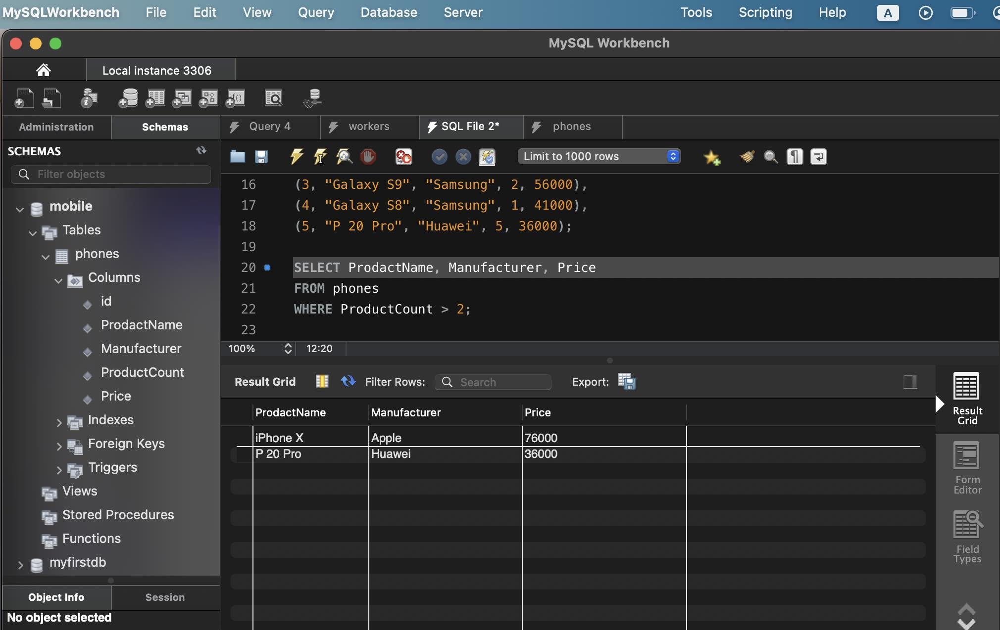
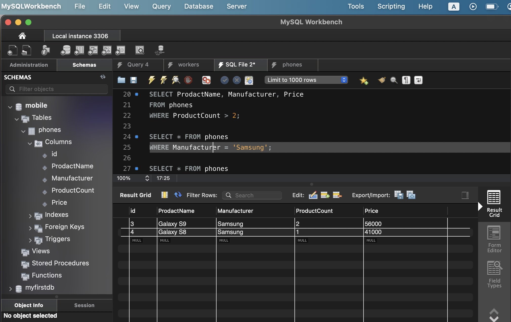

# Семинар №1. Базы данных и SQL

## SQL-скрипт с домашним заданием см. в файле


# 1. Создайте таблицу с мобильными телефонами,

используя графический интерфейс. Заполните БД данными. Добавьте скриншот на платформу в качестве ответа на ДЗ

```sql
CREATE DATABASE mobile;

USE mobile;

CREATE TABLE phones
(id INT PRIMARY KEY NOT NULL,
ProdactName VARCHAR(30) NOT NULL,
Manufacturer VARCHAR(30) NOT NULL,
ProductCount INT,
Price INT);

INSERT INTO phones(id, ProdactName, Manufacturer, ProductCount, Price)
VALUES
(1, "iPhone X", "Apple", 3, 76000),
(2, "iPhone 8", "Apple", 2, 51000),
(3, "Galaxy S9", "Samsung", 2, 56000),
(4, "Galaxy S8", "Samsung", 1, 41000),
(5, "P 20 Pro", "Huawei", 5, 36000);
```


## 2. Выведите название, производителя и цену для товаров,

количество которых превышает 2 (SQL - файл, скриншот, либо сам код)

```sql
SELECT ProdactName, Manufacturer, Price
FROM phones
WHERE ProductCount > 2;
```



## 3. Выведите весь ассортимент товаров марки “Samsung”

```sql
SELECT * FROM phones
WHERE Manufacturer = 'Samsung';
```



## 4. С помощью регулярных выражений найти:

### 4.1. Товары, в которых есть упоминание "Iphone"

```sql
SELECT * FROM phones
WHERE ProdactName LIKE '%iphone%';
```


### 4.2. "Samsung"

```sql
SELECT * FROM phones
WHERE Manufacturer REGEXP 'Samsung';
```


### 4.3. Товары, в которых есть ЦИФРА "8"

```sql
SELECT * FROM phones
WHERE ProdactName REGEXP '8';
```


