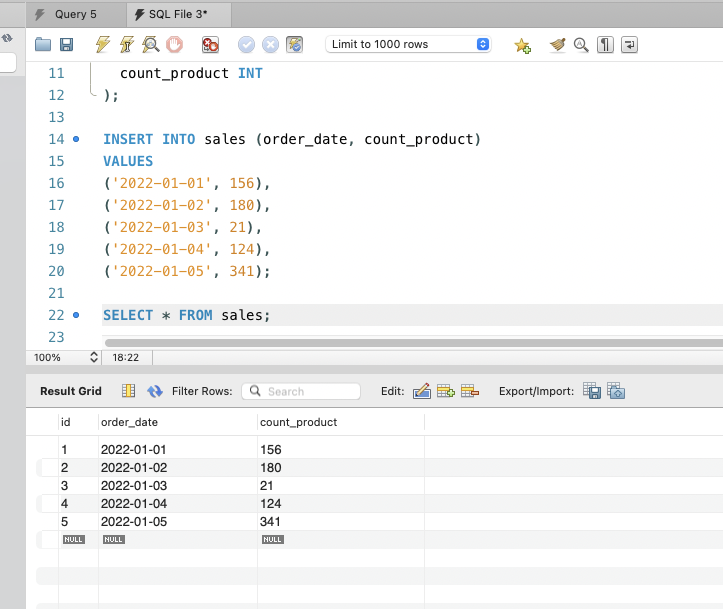
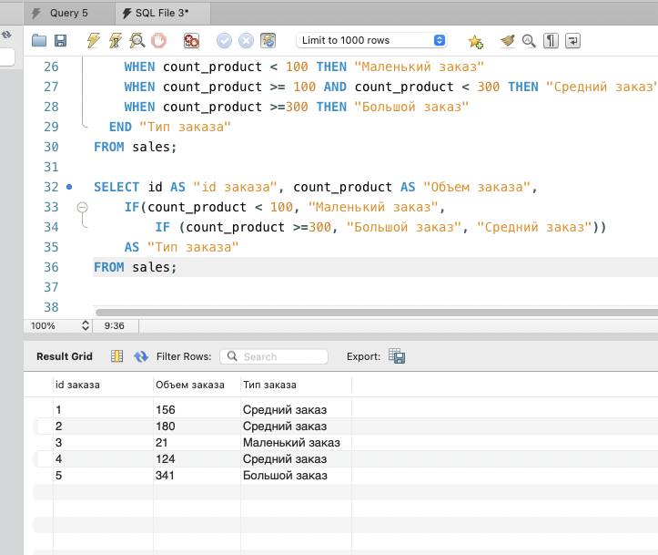
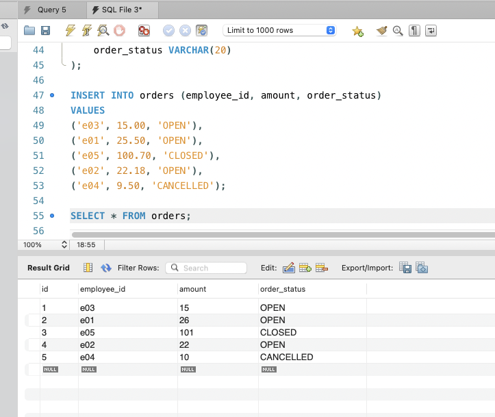
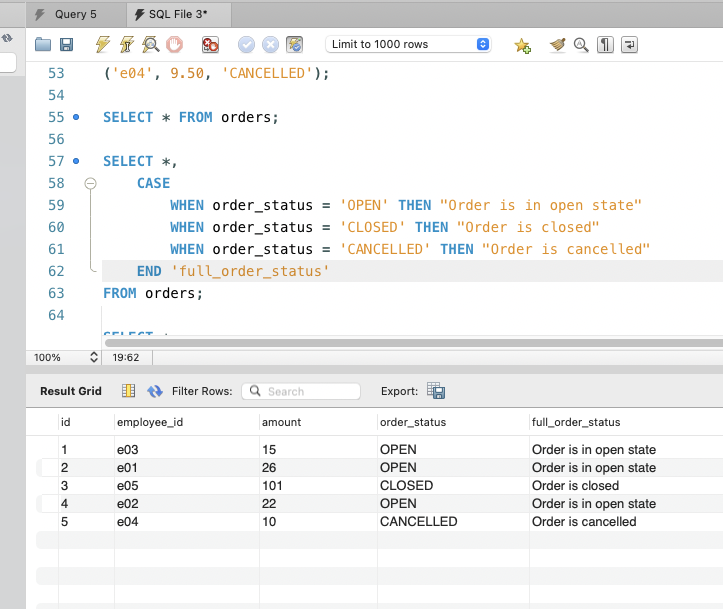

# Урок 2. SQL – создание объектов, простые запросы выборки

Файл со скриптами SQL в файле [hw02.sql](hw02.sql)

## 1. Используя операторы языка SQL,

создайте таблицу “sales”. Заполните ее данными.

```sql
DROP DATABASE IF EXISTS seminar02;
CREATE DATABASE IF NOT EXISTS seminar02;

USE seminar02;

DROP TABLE IF EXISTS sales;
CREATE TABLE IF NOT EXISTS sales
(
  id INT AUTO_INCREMENT PRIMARY KEY,
  order_date DATE,
  count_product INT
);

INSERT INTO sales (order_date, count_product)
VALUES
('2022-01-01', 156),
('2022-01-02', 180),
('2022-01-03', 21),
('2022-01-04', 124),
('2022-01-05', 341);

SELECT * FROM sales;
```



## 2. Для данных таблицы “sales”

укажите тип заказа в зависимости от кол-ва :
меньше 100 - Маленький заказ
от 100 до 300 - Средний заказ
больше 300 - Большой заказ
Сгруппируйте значений количества в 3 сегмента — меньше 100, 100-300 и больше 300, используя функцию IF

```sql
SELECT id AS "id заказа", count_product AS "Объем заказа",
	IF(count_product < 100, "Маленький заказ",
		IF (count_product >=300, "Большой заказ", "Средний заказ"))
	AS "Тип заказа"
FROM sales;
```



## 3. Создайте таблицу “orders”,

заполните ее значениями

```sql
CREATE TABLE orders
(
	id INT PRIMARY KEY AUTO_INCREMENT,
    employee_id VARCHAR(5),
    amount DECIMAL,
    order_status VARCHAR(20)
);

INSERT INTO orders (employee_id, amount, order_status)
VALUES
('e03', 15.00, 'OPEN'),
('e01', 25.50, 'OPEN'),
('e05', 100.70, 'CLOSED'),
('e02', 22.18, 'OPEN'),
('e04', 9.50, 'CANCELLED');

SELECT * FROM orders;
```



Выберите все заказы. В зависимости от поля order_status выведите столбец full_order_status:
OPEN – «Order is in open state» ; CLOSED - «Order is closed»; CANCELLED - «Order is cancelled»
Покажите “полный” статус заказа, используя оператор CASE

```sql
SELECT *,
	CASE
		WHEN order_status = 'OPEN' THEN "Order is in open state"
		WHEN order_status = 'CLOSED' THEN "Order is closed"
    WHEN order_status = 'CANCELLED' THEN "Order is cancelled"
  END 'full_order_status'
FROM orders;
```



## 4. Чем 0 отличается от NULL?

Ноль - это число, он имеет тип числа, целый, дробный и т.д.

NULL - это совсем другой тип, не число! Это именно такой тип, там ничего нет, пустота, ячейка не заполнена. И это не пустая строка.

Значение NULL не равно ни чему, даже самому себе. Если сравнить значение NULL с другим значением NULL, результатом является то, что значение NULL каждого значения NULL неизвестно.
Обычно значение NULL используется для указания того, что данные отсутствуют, неизвестны или неприменимы.

Для программиста имеет смысл, например, при проверки условий. Если значение равно нулю - это одно дело, там числа какие-то, если значение равно NULL - совсем другое, там пусто.
